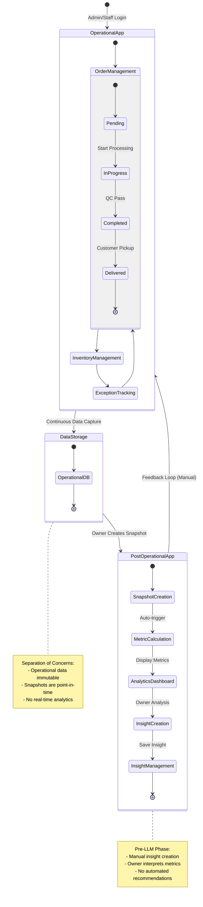
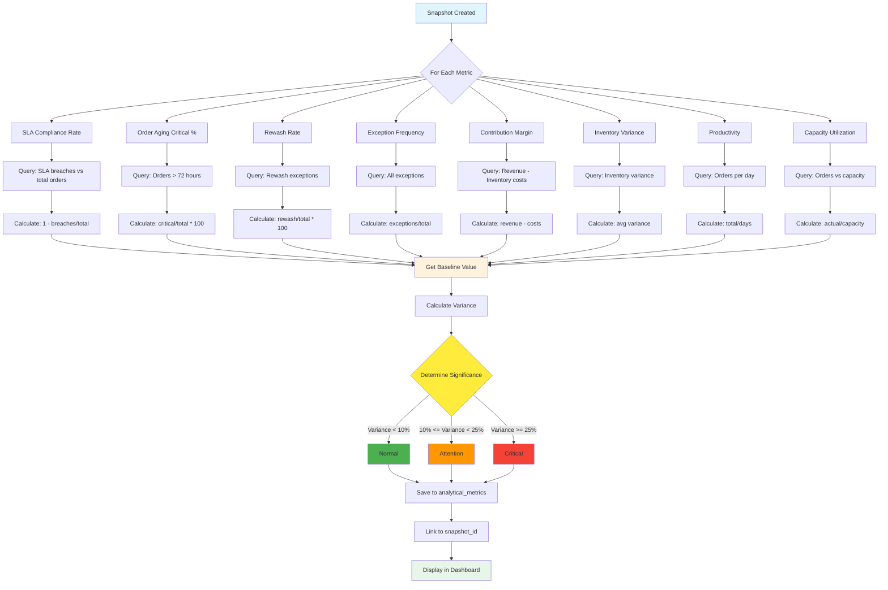
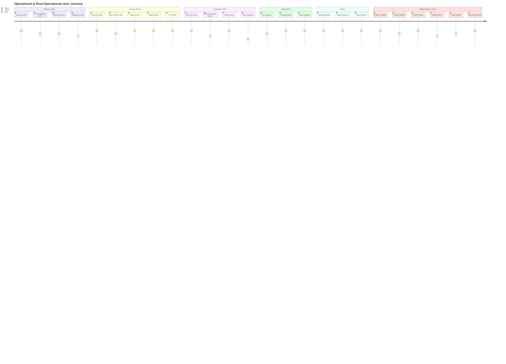
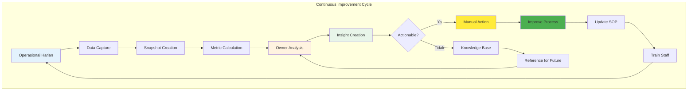

# Diagram Alur Sistem
## Warehouse Laundry Management System

**Versi**: 1.0  
**Tanggal**: 2026-01-25

---

## 🔄 DIAGRAM ALUR OPERASIONAL LENGKAP

```mermaid
graph TB
    subgraph "APLIKASI OPERASIONAL - Daily Operations"
        A[Admin Login] --> B[Dashboard Operasional]
        B --> C{Aktivitas Harian}
        
        C -->|Pesanan Baru| D[Create Order]
        D --> D1[Input Customer Data]
        D1 --> D2[Pilih Service]
        D2 --> D3[Input Berat & Harga]
        D3 --> D4[Set Target Completion]
        D4 --> D5[Status: PENDING]
        
        C -->|Proses Cucian| E[Start Processing]
        D5 --> E
        E --> E1[Status: IN_PROGRESS]
        E1 --> E2[Catat Inventory Usage]
        E2 --> E3{Ada Masalah?}
        E3 -->|Ya| E4[Catat Exception]
        E3 -->|Tidak| E5[Lanjut QC]
        E4 --> E5
        
        E5 --> F[Quality Check]
        F --> F1{QC Pass?}
        F1 -->|Tidak| E4
        F1 -->|Ya| F2[Packaging]
        F2 --> F3[Catat Inventory Usage]
        F3 --> F4[Status: COMPLETED]
        
        F4 --> G[Delivery/Pickup]
        G --> G1[Status: DELIVERED]
        G1 --> G2[Catat Payment]
        
        C -->|Kelola Inventory| H[Inventory Management]
        H --> H1[Monitor Stock]
        H1 --> H2{Low Stock?}
        H2 -->|Ya| H3[Restock]
        H2 -->|Tidak| H1
        
        G2 --> Z1[(Database Operasional)]
        E2 --> Z1
        F3 --> Z1
        H3 --> Z1
    end
    
    subgraph "APLIKASI POST-OPERATIONAL - Analytics & Insights"
        I[Owner Login] --> J[Dashboard Analytics]
        
        J --> K[Buat Snapshot]
        Z1 -.Data Query.-> K
        K --> K1[Pilih Periode]
        K1 --> K2[Generate Snapshot]
        K2 --> K3[Calculate 8 Metrics]
        K3 --> K4[Compare with Baseline]
        K4 --> K5[Determine Significance]
        K5 --> Z2[(Snapshot Data - Immutable)]
        
        Z2 --> L[Analytics Dashboard]
        L --> L1[View Metric Cards]
        L1 --> L2{Drill-down?}
        L2 -->|Ya| L3[View Metric Detail]
        L2 -->|Tidak| L1
        
        L3 --> M[Identifikasi Masalah]
        M --> N[Buat Insight Manual]
        N --> N1[Tulis Statement]
        N1 --> N2[Set Severity]
        N2 --> N3[Link Metrics]
        N3 --> N4[Mark Actionable]
        N4 --> Z3[(Insights Table)]
        
        Z3 --> O[Review Insights]
        O --> O1{Filter Insights}
        O1 --> O2[Track Progress]
        O2 --> O3[Edit/Delete Insights]
        
        O3 -.Manual Action.-> P[Improve Operations]
        P -.Feedback Loop.-> A
    end
    
    style A fill:#e1f5ff
    style I fill:#fff4e1
    style Z1 fill:#f0f0f0
    style Z2 fill:#f0f0f0
    style Z3 fill:#f0f0f0
    style D5 fill:#ffeb3b
    style E1 fill:#ff9800
    style F4 fill:#4caf50
    style G1 fill:#2196f3
```

---

## 📊 DIAGRAM DATA FLOW

```mermaid
graph LR
    subgraph "Operational Data Capture"
        A1[Orders] --> DB1[(orders table)]
        A2[Inventory Transactions] --> DB2[(inventory_transactions)]
        A3[Exceptions] --> DB3[(exceptions)]
        A4[Services] --> DB4[(services)]
    end
    
    subgraph "Snapshot Creation"
        DB1 --> S1[Query Period Data]
        DB2 --> S1
        DB3 --> S1
        DB4 --> S1
        S1 --> S2[Aggregate Data]
        S2 --> S3[Create Snapshot]
        S3 --> DB5[(data_snapshots)]
    end
    
    subgraph "Metric Calculation"
        DB5 --> M1[Calculate SLA Compliance]
        DB5 --> M2[Calculate Rewash Rate]
        DB5 --> M3[Calculate Exception Freq]
        DB5 --> M4[Calculate Contribution Margin]
        DB5 --> M5[Calculate Inventory Variance]
        DB5 --> M6[Calculate Productivity]
        DB5 --> M7[Calculate Capacity Util]
        DB5 --> M8[Calculate Order Aging]
        
        M1 --> M9[Get Baseline]
        M2 --> M9
        M3 --> M9
        M4 --> M9
        M5 --> M9
        M6 --> M9
        M7 --> M9
        M8 --> M9
        
        M9 --> M10[Calculate Variance]
        M10 --> M11[Determine Significance]
        M11 --> DB6[(analytical_metrics)]
    end
    
    subgraph "Insight Creation"
        DB6 --> I1[Display in Dashboard]
        I1 --> I2[Owner Analysis]
        I2 --> I3[Manual Insight Creation]
        I3 --> DB7[(insights)]
    end
    
    subgraph "Future: LLM Integration"
        DB6 -.-> L1[LLM Analysis]
        DB7 -.-> L1
        L1 -.-> L2[Generate Recommendations]
        L2 -.-> DB8[(recommendations)]
        DB8 -.-> L3[Create Tasks]
        L3 -.-> DB9[(tasks)]
    end
    
    style DB1 fill:#e3f2fd
    style DB2 fill:#e3f2fd
    style DB3 fill:#e3f2fd
    style DB4 fill:#e3f2fd
    style DB5 fill:#fff3e0
    style DB6 fill:#fff3e0
    style DB7 fill:#e8f5e9
    style DB8 fill:#f3e5f5,stroke-dasharray: 5 5
    style DB9 fill:#f3e5f5,stroke-dasharray: 5 5
    style L1 stroke-dasharray: 5 5
    style L2 stroke-dasharray: 5 5
    style L3 stroke-dasharray: 5 5
```

---

## 🔗 DIAGRAM TRANSISI MODUL

---

## 📈 DIAGRAM METRIC CALCULATION FLOW

---

## 🎯 DIAGRAM USER JOURNEY

---

## 🔄 DIAGRAM FEEDBACK LOOP

---

**Diagram-diagram ini melengkapi dokumentasi OPERATIONAL_WORKFLOW.md dengan visualisasi yang lebih jelas tentang alur sistem.**
