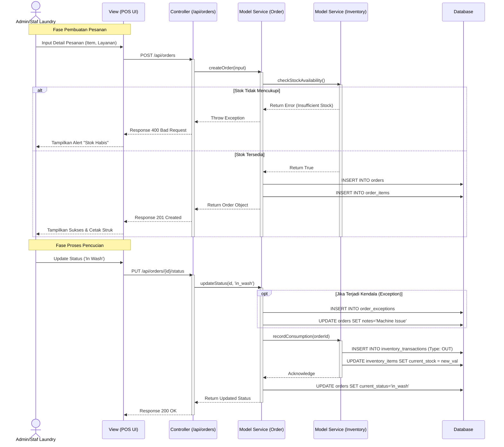
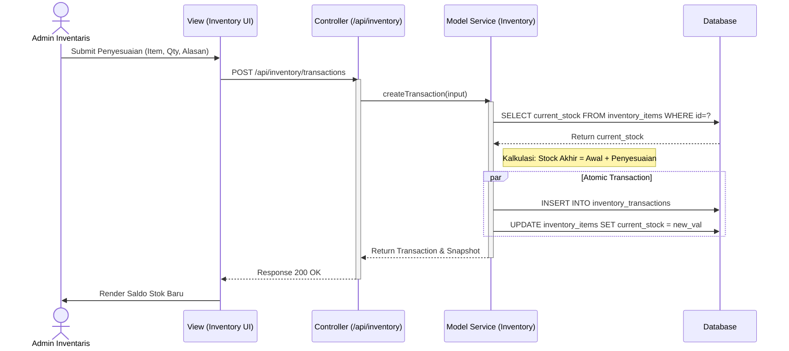
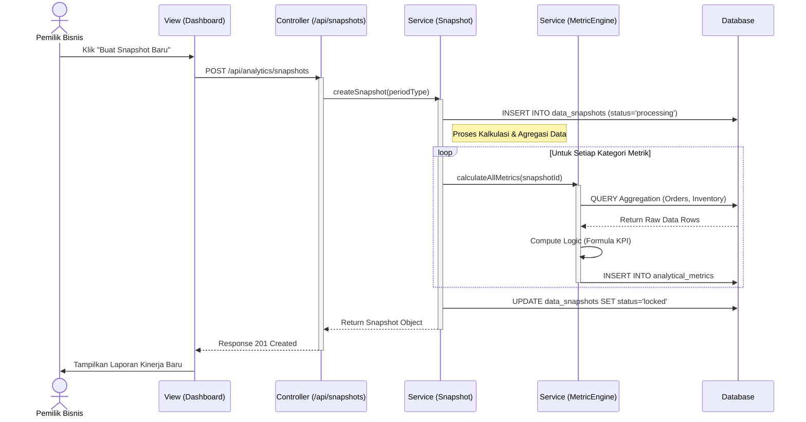
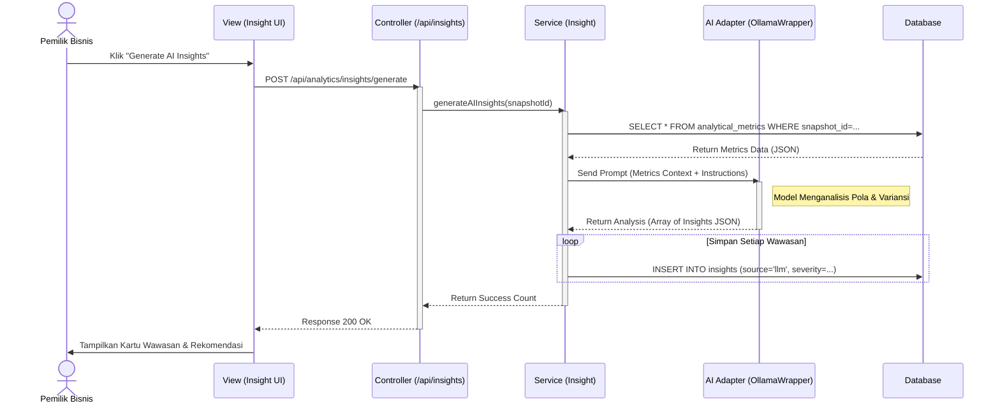
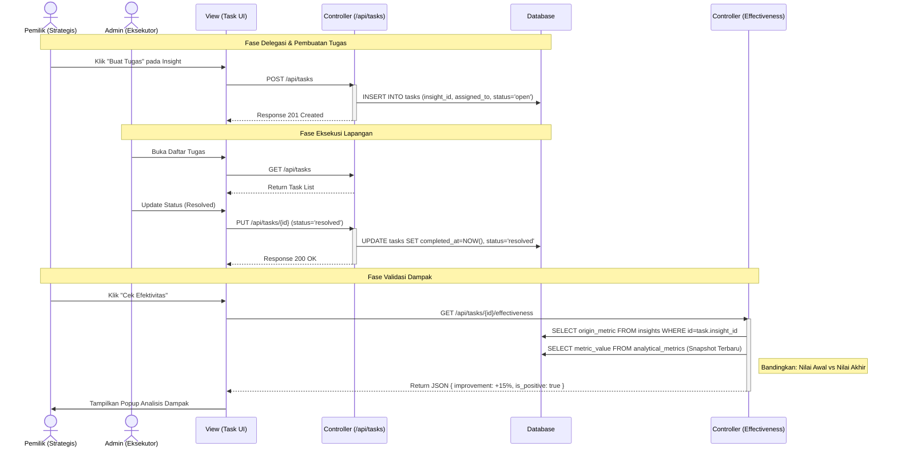

# Perancangan Sistem: Sequence## 1. Pemrosesan Pesanan (Order Processing)

### A. Pengantar
Proses pemenuhan pesanan (*order fulfillment*) merupakan alur kerja inti dalam operasional binis laundry. Alur ini mencakup validasi input, pengecekan ketersediaan stok inventaris (seperti deterjen), pencatatan transaksi ke basis data, hingga penanganan pengecualian (*exception handling*) jika terjadi kesalahan stok atau kegagalan sistem. Diagram ini menggambarkan bagaimana sistem menjamin integritas data stok dan pesanan secara *real-time*.

### B. Penjelasan Diagram
1.  **Inisiasi Pesanan**: Aktor (Admin/Staf) memasukkan rincian pesanan melalui antarmuka **POS UI**. Data ini dikirim ke API Layer sebagai permintaan `POST /api/orders`.
2.  **Validasi & Bisnis Logik**: **OrderService** menerima data dan melakukan validasi. Sebelum menyimpan pesanan, layanan ini memanggil **InventoryService** untuk memeriksa `checkStockAvailability()`.
    *   *Skenario Alternatif (Alt)*: Jika stok tidak mencukupi, sistem mengembalikan *Error* dan UI menampilkan peringatan kepada pengguna, membatalkan transaksi untuk mencegah stok negatif.
3.  **Persistensi Data**: Jika stok tersedia, pesanan disimpan ke tabel `orders` dan `order_items`. Sistem mengembalikan respon sukses (HTTP 201) ke antarmuka pengguna.
4.  **Pembaruan Status  Diagram

Dokumen ini menjelaskan alur interaksi antar objek dalam sistem Whser Laundry Management berdasarkan pola arsitektur *Model-View-Controller* (MVC). Setiap diagram merepresentasikan *use case* utama yang menangani logika bisnis kritikal.

---

& Konsumsi Material**: Saat status pesanan diperbarui menjadi 'In Wash' (sedang dicuci):
    *   Sistem mencatat 'Exception' jika terjadi kendala mesin.
    *   **InventoryService** secara otomatis mencatat pengurangan stok (*consumption*) ke tabel `inventory_transactions` dan memperbarui saldo `inventory_items`.

### C. Diagram

---

## 2. Penyesuaian Stok (Inventory Adjustment)

### A. Pengantar
Manajemen inventaris memerlukan mekanisme koreksi manual untuk menangani perbedaan antara stok fisik dan stok sistem (misalnya akibat kerusakan barang, kehilangan, atau hasil *stock opname*). Alur ini memastikan bahwa setiap perubahan saldo stok tercatat secara akuntabel dengan alasan yang jelas, menjaga integritas audit *trail* sistem.

### B. Penjelasan Diagram
1.  **Input Koreksi**: Staf memilih *item* inventaris pada **Inventory UI** dan memasukkan jumlah penyesuaian beserta alasannya (misal: "Botol Pecah").
2.  **Kalkulasi Ulang**: API meneruskan permintaan ke **InventoryService**. Layanan ini mengambil saldo `current_stock` saat ini dari basis data.
3.  **Pencatatan Transaksi**: Sistem menghitung saldo baru dan melakukan dua operasi atomik:
    *   Menyimpan riwayat di tabel `inventory_transactions` untuk rekam jejak.
    *   Memperbarui nilai `current_stock` pada tabel induk `inventory_items`.
4.  **Umpan Balik**: Saldo terbaru dikembalikan ke UI untuk memperbarui tampilan stok secara instan tanpa perlu memuat ulang halaman.

### C. Diagram

---

## 3. Pembuatan Snapshot Data (Data Aggregation)

### A. Pengantar
Sistem analitik Whser bekerja berdasarkan prinsip *snapshot*, yaitu pembekuan data operasional dalam periode tertentu (harian/mingguan) menjadi data metrik statis. Proses ini krusial untuk mencegah beban kinerja pada basis data transaksional saat pemilik melakukan analisis historis yang kompleks.

### B. Penjelasan Diagram
1.  **Pemicu Snapshot**: Pemilik memicu pembuatan snapshot melalui **Dashboard UI** (atau dijadwalkan oleh sistem).
2.  **Inisialisasi**: **SnapshotService** membuat entri baru di tabel `data_snapshots` dengan status awal 'processing' untuk menandai proses sedang berjalan.
3.  **Kalkulasi Metrik (Asinkron)**:
    *   Layanan memanggil **MetricsCalculationService** untuk menghitung berbagai KPI (Key Performance Indicators) seperti SLA Compliance, Pendapatan, dan Variansi Stok.
    *   Layanan ini melakukan *query* agregat berat ke tabel operasional (`orders`, `inventory`).
    *   Hasil kalkulasi disimpan ke tabel `analytical_metrics` sebagai data statis.
4.  **Finalisasi**: Setelah semua kalkulasi selesai, status snapshot dikunci ('locked') untuk menjamin data tidak berubah lagi, sehingga valid untuk analisis jangka panjang.

### C. Diagram

---

## 4. Pembuatan Wawasan Cerdas (AI Insight Generation)

### A. Pengantar
Fitur ini memanfaatkan *Large Language Model* (LLM) Gemma 2 4B via Ollama untuk menganalisis data metrik yang telah dibentuk dalam proses Snapshot. Tujuannya adalah menerjemahkan angka statistik menjadi narasi bisnis kualitatif dan rekomendasi strategis yang mudah dipahami oleh pemilik usaha.

### B. Penjelasan Diagram
1.  **Permintaan Analisis**: Pemilik meminta analisis AI pada snapshot tertentu.
2.  **Pengambilan Konteks**: **InsightService** mengambil seluruh data metrik dari basis data untuk snapshot tersebut dan memformatnya menjadi *prompt* JSON terstruktur.
3.  **Inferensi AI**:
    *   Data dikirim ke **OllamaWrapper** yang berinteraksi dengan model lokal.
    *   Model melakukan penalaran (reasoning) untuk mengidentifikasi anomali, tren positif/negatif, dan akar masalah.
4.  **Penyimpanan Wawasan**: Respon dari AI disimpan ke tabel `insights` dengan atribut keparahan (*severity*) dan kategori, siap untuk ditampilkan atau ditindaklanjuti menjadi tugas.

### C. Diagram

---

## 5. Manajemen & Efektivitas Tugas (Task Effectiveness)

### A. Pengantar
Siklus perbaikan berkelanjutan (*continuous improvement*) ditutup dengan mengubah wawasan menjadi tindakan nyata (Talk). Diagram ini mendemonstrasikan alur kerja lengkap: mulai dari Pemilik membuat tugas berdasarkan wawasan, Admin menyelesaikan tugas tersebut, hingga sistem memverifikasi apakah tindakan tersebut efektif meningkatkan metrik kinerja.

### B. Penjelasan Diagram
1.  **Delegasi Tugas**: Pemilik membuat tugas baru yang terhubung langsung dengan `insight_id`. Tugas ini didelegasikan kepada Admin.
2.  **Eksekusi Operasional**: Admin melihat tugas di papan kerjanya, menandai 'In Progress', melakukan perbaikan di lapangan, dan akhirnya menandai 'Resolved'.
3.  **Verifikasi Sistem**:
    *   Setelah tugas selesai, Pemilik melakukan pengecekan efektivitas (`checkEffectiveness`).
    *   Sistem membandingkan nilai metrik pada saat masalah ditemukan (*Origin Metric*) dengan nilai metrik pada snapshot terbaru (*Current Metric*).
    *   Selisih (*Improvement*) ditampilkan untuk membuktikan ROI dari tindakan perbaikan tersebut.

### C. Diagram

