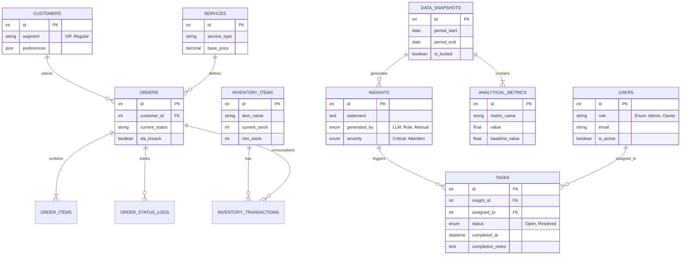
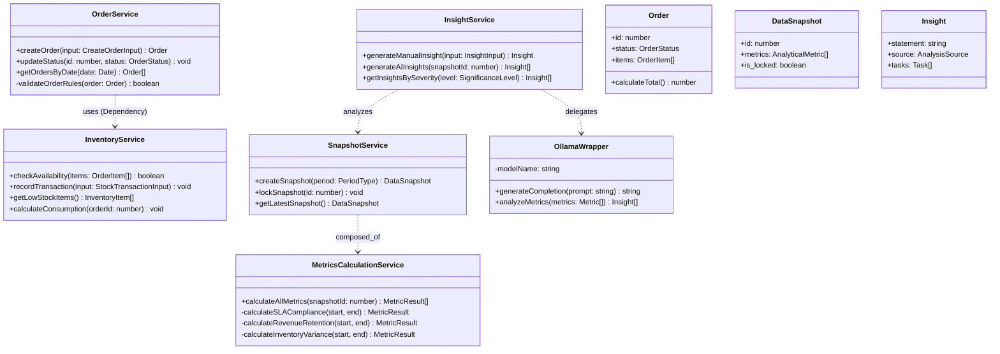

# Perancangan Sistem: Diagram Struktural

Dokumen ini memetakan arsitektur data dan struktur kode program dari platform Whser Laundry Management. Diagram ini mencakup desain basis data relasional (ERD) dan struktur kelas perangkat lunak (Class Diagram).

---

## 1. Entity Relationship Diagram (ERD)

### A. Pengantar
Perancangan basis data sistem ini memisahkan secara tegas antara **Data Operasional** (transaksional, *real-time*) dengan **Data Analitik** (historis, statis). Pendekatan ini dipilih untuk menjaga performa aplikasi kasir (POS) tetap optimal saat volume data membesar, sembari memungkinkan analisis data yang kompleks di sisi manajemen. 
Tabel `tasks` berfungsi sebagai jembatan penghubung yang mengubah wawasan analitik menjadi aksi operasional yang dapat dilacak.

### B. Penjelasan Diagram
1.  **Zona Operasional (Core)**:
    *   Entitas `ORDERS` adalah pusat transaksi yang terhubung dengan `CUSTOMERS` (pelanggan) dan `SERVICES` (layanan).
    *   Setiap pesanan memiliki detail item (`ORDER_ITEMS`) dan riwayat status (`ORDER_STATUS_LOGS`) untuk pelacakan alur kerja.
    *   Manajemen inventaris dikelola melalui relasi `INVENTORY_ITEMS` dan `INVENTORY_TRANSACTIONS` untuk mencatat keluar-masuk barang.
2.  **Zona Analitik**:
    *   `DATA_SNAPSHOTS` menyimpan rekam data berkala. Satu snapshot memiliki banyak `ANALYTICAL_METRICS` (KPI).
    *   `INSIGHTS` adalah hasil analisis cerdas yang dihasilkan dari snapshot tersebut.
3.  **Jembatan Aksi**:
    *   `TASKS` menghubungkan `INSIGHTS` (masalah yang ditemukan) dengan `USERS` (staf yang ditugaskan), memungkinkan siklus "Data ke Aksi".

### C. Diagram

---

## 2. Class Diagram

### A. Pengantar
Sistem dikembangkan menggunakan arsitektur berorientasi layanan (*Service-Oriented Architecture*). Logika bisnis dienkapsulasi ke dalam kelas-kelas *Service* yang terpisah dari *Controller* (API Layer) dan *Data Models*. Hal ini meningkatkan *maintainability* dan memudahkan pengujian unit. Kelas khusus seperti `OllamaWrapper` bertindak sebagai adaptor untuk komunikasi dengan layanan AI eksternal.

### B. Penjelasan Diagram
1.  **Core Services**:
    *   `OrderService`: Menangani siklus hidup pesanan. Memiliki dependensi ke `InventoryService` untuk pengecekan stok.
    *   `InventoryService`: Mengelola transaksi stok atomik dan kalkulasi konsumsi bahan baku.
2.  **Analytics Services**:
    *   `SnapshotService`: Orkutrator pembuatan snapshot yang memanggil `MetricsCalculationService`.
    *   `MetricsCalculationService`: Berisi algoritma murni untuk menghitung KPI (misal: *Return on Investment* atau Tingkat Kepatuhan SLA).
    *   `InsightService`: Mengelola pembuatan wawasan, baik manual maupun via AI.
3.  **AI Integration**:
    *   `OllamaWrapper`: Kelas utilitas yang menangani komunikasi HTTP ke model LLM lokal, termasuk pembentukan *prompt*.
4.  **Relasi**: Diagram menunjukkan bagaimana `InsightService` bergantung pada data dari `SnapshotService`, dan bagaimana `OrderService` bergantung pada validasi dari `InventoryService`.

### C. Diagram

